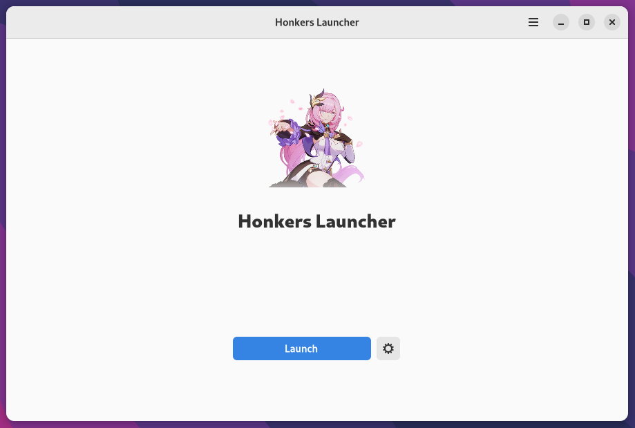

<br>

<p align="center">You could also try <a href="https://github.com/an-anime-team/honkers-launcher">the main branch</a></p>

<br>

# Development

| Folder | Description |
| - | - |
| ui | Blueprint UI files |
| ui/.dist | UI files compiled by the blueprint |
| src | Rust source code |
| target/release | Release build of the app |
| blueprint-compiler | Blueprint compiler |
| anime-game-core | Anime Game Core library |

## Clone repo

```sh
git clone --recursive https://github.com/an-anime-team/honkers-launcher-gtk
```

## Run app

```sh
cargo run
```

## Build app

```sh
cargo build --release
```
